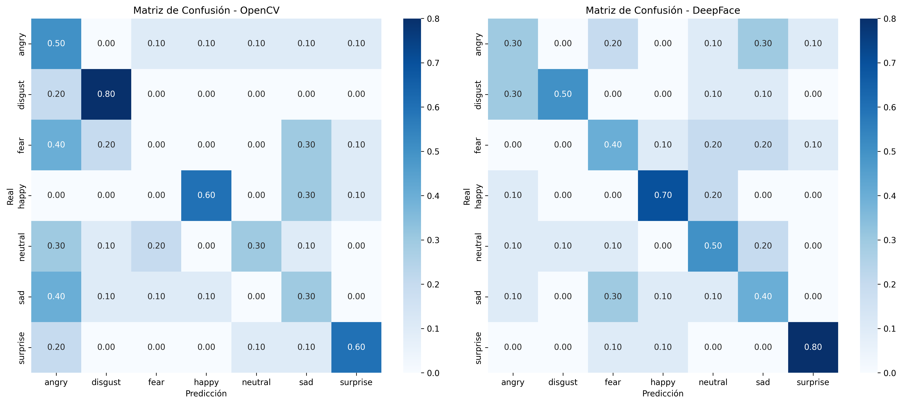
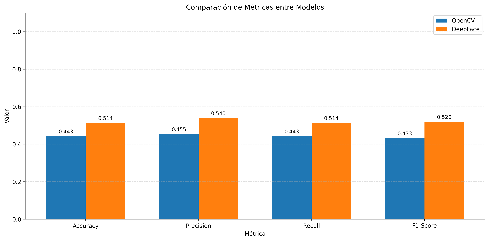
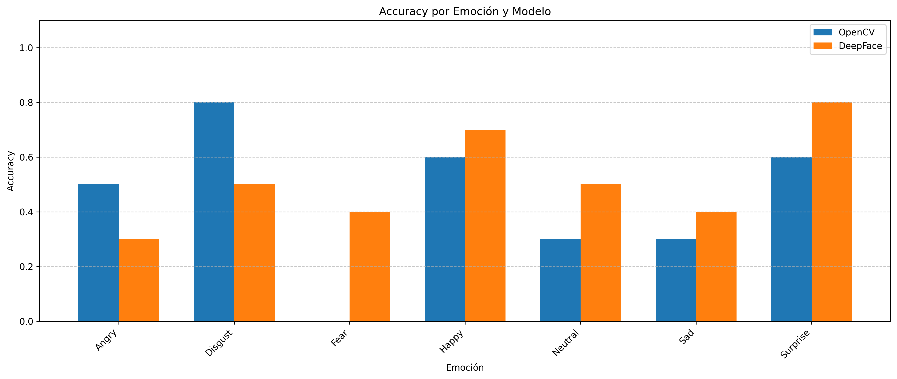
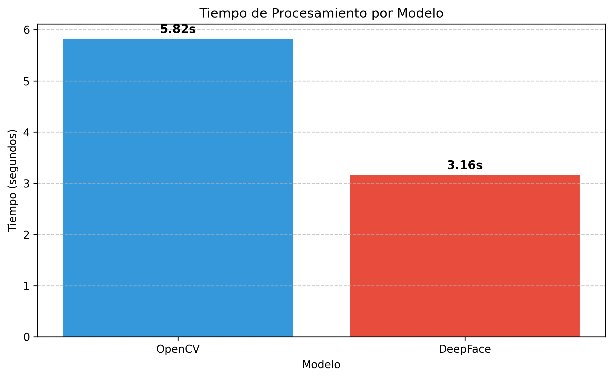

# Evaluación Comparativa de Modelos de Reconocimiento Facial de Emociones
## FER (Mini-Xception) vs DeepFace usando el Dataset FER2013

---

## Resumen / Abstract

Este trabajo presenta una evaluación comparativa entre dos modelos **preentrenados** de reconocimiento facial de emociones ampliamente utilizados en visión por computadora: **FER (Mini-Xception)** y **DeepFace** (basado en redes neuronales convolucionales).

El objetivo principal es analizar su desempeño sobre el conjunto de datos **FER2013**, que contiene más de 35,000 imágenes etiquetadas con siete emociones básicas: anger (enojo), disgust (disgusto), fear (miedo), happy (felicidad), neutral, sad (tristeza) y surprise (sorpresa).

La metodología comprende la implementación de ambos modelos preentrenados en Python, la ejecución de pruebas sobre las mismas imágenes y la obtención de métricas de precisión (accuracy), recall y F1-score. Al utilizar dos modelos preentrenados, se garantiza una comparación justa en igualdad de condiciones.

Los resultados permiten identificar qué modelo ofrece mayor exactitud y estabilidad al reconocer expresiones faciales humanas. Ambos modelos utilizan redes neuronales convolucionales preentrenadas, lo que permite una comparación directa de sus arquitecturas y rendimiento.

**Palabras clave:** Reconocimiento facial, emociones, FER, Mini-Xception, DeepFace, FER2013, visión por computadora, deep learning, CNN.

---

## Tabla de Contenidos

1. [Introducción](#1-introducción)
2. [Planteamiento del Problema](#2-planteamiento-del-problema)
3. [Justificación](#3-justificación)
4. [Objetivos](#4-objetivos)
5. [Marco Teórico](#5-marco-teórico)
6. [Metodología](#6-metodología)
7. [Implementación](#7-implementación)
8. [Resultados y Análisis](#8-resultados-y-análisis)
9. [Conclusiones](#9-conclusiones)
10. [Recomendaciones](#10-recomendaciones)
11. [Referencias Bibliográficas](#11-referencias-bibliográficas)
12. [Anexos: Guía de Instalación y Uso](#12-anexos-guía-de-instalación-y-uso)

---

## 1. Introducción

### 1.1 ¿Qué es el Reconocimiento Facial de Emociones?

El reconocimiento facial de emociones es una rama de la visión por computadora que busca identificar y clasificar las expresiones emocionales de los seres humanos a partir de imágenes o videos de sus rostros. Esta tecnología analiza características faciales como la posición de cejas, forma de los ojos, curvatura de la boca y arrugas en la frente para determinar el estado emocional de una persona.

El psicólogo Paul Ekman identificó en la década de 1970 seis emociones básicas universales: felicidad, tristeza, enojo, miedo, sorpresa y disgusto. A estas se añade comúnmente el estado "neutral", conformando las siete categorías que utiliza el dataset FER2013.

### 1.2 Importancia y Actualidad del Tema

El reconocimiento automático de emociones tiene aplicaciones crecientes en múltiples campos:

- **Salud mental:** Detección de signos de depresión, ansiedad o estrés.
- **Educación:** Sistemas adaptativos que evalúan el engagement de los estudiantes.
- **Marketing:** Análisis de reacciones de consumidores ante productos o anuncios.
- **Seguridad:** Detección de comportamientos sospechosos en aeropuertos o espacios públicos.
- **Automotriz:** Sistemas de seguridad que detectan fatiga o distracción del conductor.
- **Interacción humano-computadora:** Asistentes virtuales más empáticos y naturales.

Con el avance del deep learning y el aumento de la capacidad computacional, estos sistemas han mejorado significativamente su precisión, aunque persisten desafíos relacionados con la variabilidad de expresiones, condiciones de iluminación y diferencias culturales.

### 1.3 Herramientas Utilizadas

Este proyecto compara dos enfoques de deep learning preentrenados:

- **FER (Mini-Xception):** Biblioteca de Python que utiliza una red neuronal convolucional ligera llamada Mini-Xception. Este modelo viene preentrenado para reconocimiento de emociones faciales y no requiere entrenamiento adicional. Es más ligero y rápido que modelos más profundos.

- **DeepFace:** Framework de Python que proporciona modelos preentrenados de deep learning para análisis facial. Utiliza redes neuronales convolucionales (CNN) más profundas que han sido entrenadas con millones de imágenes.

**Nota importante:** Ambos modelos son preentrenados, lo que garantiza una comparación justa en igualdad de condiciones.

### 1.4 Alcance del Trabajo

Este trabajo consiste en implementar ambos modelos, evaluarlos sobre el mismo conjunto de datos (FER2013) y comparar su rendimiento mediante métricas estandarizadas, identificando ventajas y limitaciones de cada enfoque.

---

## 2. Planteamiento del Problema

### 2.1 Problema General

Los modelos de detección de emociones faciales presentan variaciones significativas en su precisión, dependiendo del algoritmo y los datos empleados. Esta variabilidad dificulta seleccionar el modelo más adecuado para aplicaciones prácticas de análisis emocional, ya que cada enfoque tiene diferentes requerimientos computacionales, tiempos de procesamiento y niveles de exactitud.

### 2.2 Problemas Específicos

1. **¿Qué diferencias existen entre los resultados obtenidos por los modelos FER (Mini-Xception) y DeepFace en el reconocimiento de emociones faciales?**
   - Se busca identificar las discrepancias en las predicciones de ambos modelos preentrenados sobre el mismo conjunto de imágenes.

2. **¿Qué modelo muestra mayor precisión y estabilidad al trabajar con el dataset FER2013?**
   - Se evaluará mediante métricas cuantitativas cuál modelo presenta mejor desempeño general y por categoría de emoción.

3. **¿Qué limitaciones presentan ambos enfoques en entornos reales o simulados?**
   - Se analizarán los casos de falla, tiempos de procesamiento y requerimientos de recursos de cada modelo.

---

## 3. Justificación

El reconocimiento facial de emociones es una tecnología fundamental en el desarrollo de sistemas inteligentes aplicados en educación, marketing, salud y seguridad. Sin embargo, los modelos disponibles presentan diferencias significativas en desempeño y confiabilidad.

### 3.1 Justificación Técnica

Existen múltiples enfoques de deep learning para el reconocimiento de emociones:
- **Modelos ligeros:** Como Mini-Xception (FER), diseñados para ser eficientes con menor consumo de recursos.
- **Modelos profundos:** Como los utilizados por DeepFace, con arquitecturas más complejas y mayor capacidad de generalización.

Comparar ambos enfoques preentrenados permite entender los trade-offs entre eficiencia computacional y exactitud.

### 3.2 Justificación Práctica

Este proyecto busca proporcionar una guía práctica para desarrolladores e investigadores que necesiten seleccionar un modelo de reconocimiento de emociones, considerando:
- Recursos computacionales disponibles
- Requerimientos de velocidad de procesamiento
- Nivel de precisión necesario
- Facilidad de implementación

### 3.3 Justificación Académica

El trabajo permite comprender:
- Cómo se evalúan modelos preentrenados de visión artificial
- Diferencias entre arquitecturas CNN ligeras y profundas
- Métricas de evaluación en problemas de clasificación multiclase
- Buenas prácticas en la comparación de modelos en igualdad de condiciones

---

## 4. Objetivos

### 4.1 Objetivo General

Evaluar comparativamente el desempeño de los modelos preentrenados de reconocimiento facial de emociones **FER (Mini-Xception)** y **DeepFace**, utilizando el conjunto de datos **FER2013**.

### 4.2 Objetivos Específicos

1. **Implementar los modelos preentrenados** FER (Mini-Xception) y DeepFace (CNN) en un entorno controlado de Python.

2. **Aplicar ambos modelos** sobre el conjunto de imágenes de test de FER2013, asegurando condiciones idénticas de evaluación.

3. **Medir métricas de rendimiento** incluyendo:
   - Accuracy (exactitud global)
   - Precision (precisión por clase)
   - Recall (sensibilidad por clase)
   - F1-Score (media armónica de precisión y recall)
   - Tiempo de procesamiento

4. **Analizar y comparar los resultados** obtenidos mediante visualizaciones (matrices de confusión, gráficos comparativos).

5. **Identificar las principales ventajas y limitaciones** de cada modelo para diferentes casos de uso.

---

## 5. Marco Teórico

### 5.1 Reconocimiento Facial de Emociones

#### 5.1.1 Concepto

El reconocimiento facial de emociones (FER - Facial Emotion Recognition) es el proceso automático de identificar el estado emocional de una persona mediante el análisis de su expresión facial. Combina técnicas de:
- **Detección de rostros:** Localizar la región facial en una imagen.
- **Extracción de características:** Identificar rasgos relevantes (ojos, cejas, boca).
- **Clasificación:** Asignar una categoría emocional basándose en las características.

#### 5.1.2 Historia

- **1970s:** Paul Ekman propone las 6 emociones básicas universales.
- **1990s:** Primeros sistemas automáticos basados en puntos faciales (FACS - Facial Action Coding System).
- **2000s:** Uso de métodos de machine learning tradicionales (SVM, HMM).
- **2010s-presente:** Revolución del deep learning con CNNs que logran precisiones superiores al 70% en datasets como FER2013.

#### 5.1.3 Emociones Básicas de Ekman

| Emoción | Características Faciales |
|---------|-------------------------|
| Felicidad | Comisuras de labios hacia arriba, patas de gallo |
| Tristeza | Cejas caídas, comisuras hacia abajo |
| Enojo | Cejas fruncidas, mandíbula tensa |
| Miedo | Ojos abiertos, cejas levantadas |
| Sorpresa | Ojos y boca abiertos, cejas arqueadas |
| Disgusto | Nariz arrugada, labio superior levantado |
| Neutral | Sin tensión muscular aparente |

### 5.2 Visión por Computadora

#### 5.2.1 Principios Básicos

La visión por computadora es el campo de la inteligencia artificial que permite a las máquinas interpretar y entender el contenido visual. Los pasos fundamentales incluyen:

1. **Adquisición de imagen:** Captura mediante cámaras o sensores.
2. **Preprocesamiento:** Ajuste de iluminación, escala, ruido.
3. **Segmentación:** División de la imagen en regiones de interés.
4. **Extracción de características:** Identificación de patrones relevantes.
5. **Clasificación/Reconocimiento:** Asignación de etiquetas o interpretaciones.

#### 5.2.2 Detección de Rostros

Técnicas comunes:
- **Haar Cascades:** Detectores basados en características de Haar con clasificadores en cascada (Viola-Jones, 2001).
- **HOG + SVM:** Histogramas de gradientes orientados con máquinas de vectores de soporte.
- **CNN-based:** Detectores modernos como MTCNN, RetinaFace, SSD.

### 5.3 Deep Learning y Redes Neuronales Convolucionales

#### 5.3.1 Conceptos Básicos

Las **Redes Neuronales Convolucionales (CNN)** son arquitecturas de deep learning especializadas en procesamiento de imágenes. Sus componentes principales son:

- **Capas Convolucionales:** Aplican filtros para detectar características locales (bordes, texturas, formas).
- **Capas de Pooling:** Reducen la dimensionalidad manteniendo información importante.
- **Capas Fully Connected:** Combinan características para la clasificación final.
- **Funciones de Activación:** Introducen no-linealidades (ReLU, Softmax).

#### 5.3.2 Arquitecturas Relevantes

| Arquitectura | Año | Características |
|-------------|-----|-----------------|
| VGGFace | 2015 | 16-19 capas, filtros 3x3, muy profunda |
| FaceNet | 2015 | Embeddings de 128-d, triplet loss |
| ResNet | 2015 | Conexiones residuales, hasta 152 capas |
| ArcFace | 2018 | Angular margin loss, state-of-the-art |

### 5.4 Dataset FER2013

#### 5.4.1 Descripción

El **Facial Expression Recognition 2013 (FER2013)** es un dataset público creado para la competencia de Kaggle en 2013. Es uno de los más utilizados para benchmarking de sistemas de reconocimiento de emociones.

#### 5.4.2 Características

| Característica | Valor |
|---------------|-------|
| Total de imágenes | ~35,887 |
| Imágenes de entrenamiento | ~28,709 |
| Imágenes de test | ~7,178 |
| Tamaño de imagen | 48×48 píxeles |
| Formato | Escala de grises |
| Clases | 7 emociones |

#### 5.4.3 Distribución de Clases

```
Angry:    4,953 (13.8%)
Disgust:    547 (1.5%)
Fear:     5,121 (14.3%)
Happy:    8,989 (25.0%)
Neutral:  6,198 (17.3%)
Sad:      6,077 (16.9%)
Surprise: 4,002 (11.2%)
```

**Nota:** El dataset presenta desbalance de clases, siendo "Disgust" la menos representada y "Happy" la más común.

### 5.5 Modelos Utilizados

#### 5.5.1 FER (Mini-Xception) - CNN Ligera Preentrenada

**Componentes:**

1. **Detección de Rostros:**
   - Soporte para Haar Cascade (rápido) o MTCNN (más preciso)
   - Detección automática de regiones faciales

2. **Arquitectura Mini-Xception:**
   - Red neuronal convolucional ligera basada en Xception
   - Utiliza convoluciones separables en profundidad (depthwise separable convolutions)
   - Aproximadamente 60,000 parámetros (muy compacta)
   - Preentrenada específicamente para reconocimiento de emociones

3. **Clasificación:**
   - Capa softmax para 7 emociones
   - Retorna probabilidades para cada clase

**Ventajas:**
- Modelo preentrenado listo para usar
- Bajo consumo de recursos comparado con modelos profundos
- Rápido tiempo de inferencia (~50-100ms por imagen)
- No requiere GPU obligatoriamente
- Arquitectura moderna basada en CNN

**Desventajas:**
- Menor capacidad de generalización que modelos más profundos
- Puede ser menos robusto a variaciones extremas

#### 5.5.2 DeepFace - Enfoque Deep Learning

**Componentes:**

1. **Detección de Rostros:**
   - Soporta múltiples backends: OpenCV, SSD, MTCNN, RetinaFace
   - Detección robusta en diferentes condiciones

2. **Modelo de Emociones:**
   - CNN preentrenada específicamente para FER
   - Arquitectura basada en VGG modificada
   - Entrenada con millones de imágenes faciales

**Ventajas:**
- Alta precisión (~65-70% en FER2013)
- Robusto a variaciones
- No requiere feature engineering
- Modelos preentrenados disponibles

**Desventajas:**
- Mayor consumo de recursos
- Más lento sin GPU
- Modelo de caja negra
- Dependencia de frameworks pesados (TensorFlow)

---

## 6. Metodología

### 6.1 Tipo de Investigación

- **Aplicada:** Se implementan modelos existentes para resolver un problema concreto.
- **Comparativa:** Se contrastan dos enfoques diferentes para la misma tarea.
- **Cuantitativa:** Se utilizan métricas numéricas para la evaluación.

### 6.2 Herramientas y Recursos

#### 6.2.1 Software

| Herramienta | Versión | Propósito |
|-------------|---------|-----------|
| Python | 3.8+ | Lenguaje de programación |
| FER | 22.4+ | Modelo Mini-Xception preentrenado |
| OpenCV | 4.5+ | Procesamiento de imágenes |
| DeepFace | 0.0.79+ | Framework de deep learning facial |
| TensorFlow | 2.10+ | Backend de deep learning |
| scikit-learn | 1.0+ | Métricas de evaluación |
| NumPy | 1.21+ | Operaciones numéricas |
| Matplotlib/Seaborn | - | Visualizaciones |
| tqdm | 4.62+ | Barras de progreso |

#### 6.2.2 Hardware Recomendado

- **Mínimo:** CPU 4 cores, 8GB RAM
- **Recomendado:** GPU NVIDIA con CUDA para DeepFace
- **Almacenamiento:** ~2GB para dataset y modelos

### 6.3 Procedimiento Experimental

```
┌─────────────────────────────────────────────────────────────┐
│                    FLUJO DE TRABAJO                         │
├─────────────────────────────────────────────────────────────┤
│                                                             │
│  1. CARGA DEL DATASET FER2013                              │
│     ├── Imágenes de entrenamiento (28,709)                 │
│     └── Imágenes de test (7,178)                           │
│                          │                                  │
│                          ▼                                  │
│  2. PREPROCESAMIENTO                                        │
│     ├── Normalización de imágenes                          │
│     ├── Ecualización de histograma                         │
│     └── Selección de muestra representativa                │
│                          │                                  │
│                          ▼                                  │
│  3. IMPLEMENTACIÓN DE MODELOS                              │
│     ├── FER: Mini-Xception (CNN ligera preentrenada)       │
│     └── DeepFace: CNN profunda preentrenada                │
│                          │                                  │
│                          ▼                                  │
│  4. EVALUACIÓN                                             │
│     ├── Ejecutar predicciones sobre test set               │
│     ├── Calcular métricas por modelo                       │
│     └── Medir tiempos de procesamiento                     │
│                          │                                  │
│                          ▼                                  │
│  5. ANÁLISIS COMPARATIVO                                   │
│     ├── Matrices de confusión                              │
│     ├── Gráficos de rendimiento                            │
│     └── Tablas comparativas                                │
│                                                             │
└─────────────────────────────────────────────────────────────┘
```

### 6.4 Métricas de Evaluación

#### 6.4.1 Accuracy (Exactitud)

Proporción de predicciones correctas sobre el total.

```
Accuracy = (TP + TN) / (TP + TN + FP + FN)
```

#### 6.4.2 Precision (Precisión)

Proporción de positivos predichos que son realmente positivos.

```
Precision = TP / (TP + FP)
```

#### 6.4.3 Recall (Sensibilidad)

Proporción de positivos reales que fueron correctamente identificados.

```
Recall = TP / (TP + FN)
```

#### 6.4.4 F1-Score

Media armónica de precisión y recall.

```
F1 = 2 × (Precision × Recall) / (Precision + Recall)
```

#### 6.4.5 Macro vs Weighted Average

- **Macro:** Promedio simple de las métricas por clase (trata todas las clases por igual).
- **Weighted:** Promedio ponderado por el número de muestras por clase (considera el desbalance).

---

## 7. Implementación

### 7.1 Estructura del Proyecto

```
actarea/
├── fer2013/                    # Dataset
│   ├── train/                  # Imágenes de entrenamiento
│   │   ├── angry/
│   │   ├── disgust/
│   │   ├── fear/
│   │   ├── happy/
│   │   ├── neutral/
│   │   ├── sad/
│   │   └── surprise/
│   └── test/                   # Imágenes de test
│       └── [mismas carpetas]
├── src/                        # Código fuente
│   ├── __init__.py
│   ├── config.py               # Configuración global
│   ├── data_loader.py          # Carga de datos
│   ├── fer_model.py            # Modelo FER (Mini-Xception)
│   ├── deepface_model.py       # Modelo DeepFace
│   └── evaluation.py           # Métricas y visualizaciones
├── results/                    # Resultados generados
├── models/                     # Modelos guardados
├── main.py                     # Script principal de comparación
├── test_models.py              # Pruebas unitarias
├── demo.py                     # Demostración con imágenes
├── webcam_demo.py              # Demo básico con webcam
├── webcam_dashboard.py         # Dashboard profesional con webcam
├── requirements.txt            # Dependencias
└── README.md                   # Este documento
```

### 7.2 Descripción Detallada de Archivos Python

#### 7.2.1 `src/config.py` - Configuración Global
Define todas las constantes y rutas del proyecto:
- **Rutas:** Directorios base, datos, resultados y modelos
- **Emociones:** Lista de las 7 emociones del dataset FER2013
- **Parámetros:** Tamaño de imagen (48x48), semilla aleatoria, tamaño de muestreo
- **Mapeos:** Conversión entre nombres de emociones de DeepFace y FER2013

```python
# Ejemplo de uso
from src.config import EMOTIONS, TRAIN_DIR, TEST_DIR
print(EMOTIONS)  # ['angry', 'disgust', 'fear', 'happy', 'neutral', 'sad', 'surprise']
```

#### 7.2.2 `src/data_loader.py` - Cargador de Datos
Clase `DataLoader` que maneja la carga del dataset FER2013:
- **`get_dataset_info()`**: Retorna estadísticas del dataset (imágenes por emoción)
- **`load_test_images()`**: Carga rutas de imágenes de test con sus etiquetas
- **`load_train_images()`**: Carga rutas de imágenes de entrenamiento
- **`print_dataset_info()`**: Imprime resumen del dataset en consola

```python
# Ejemplo de uso
loader = DataLoader()
loader.print_dataset_info()
images, labels = loader.load_test_images(sample_size_per_emotion=50)
```

#### 7.2.3 `src/fer_model.py` - Modelo FER (Mini-Xception Preentrenado)
Clase `FEREmotionRecognizer` que implementa reconocimiento con CNN ligera preentrenada:
- **`predict()`**: Predice la emoción de una imagen facial
- **`predict_from_frame()`**: Predice desde un frame de video (numpy array)
- **`predict_batch()`**: Predice emociones para múltiples imágenes con barra de progreso

**Nota:** Este modelo viene preentrenado, no requiere entrenamiento adicional.

```python
# Ejemplo de uso
from src.fer_model import FEREmotionRecognizer
model = FEREmotionRecognizer()
emotion, probabilities = model.predict("imagen.jpg")
```

#### 7.2.4 `src/deepface_model.py` - Modelo DeepFace (Deep Learning)
Clase `DeepFaceEmotionRecognizer` que utiliza redes neuronales preentrenadas:
- **`predict()`**: Analiza una imagen y retorna la emoción dominante con probabilidades
- **`predict_batch()`**: Procesa múltiples imágenes con barra de progreso
- **`analyze_image_detailed()`**: Análisis completo incluyendo edad, género y raza

```python
# Ejemplo de uso
model = DeepFaceEmotionRecognizer()
emotion, probabilities = model.predict("imagen.jpg")
detailed = model.analyze_image_detailed("imagen.jpg")
```

#### 7.2.5 `src/evaluation.py` - Evaluación y Métricas
Clase `ModelEvaluator` para análisis comparativo:
- **`evaluate_predictions()`**: Calcula métricas (accuracy, precision, recall, F1)
- **`compare_models()`**: Genera DataFrame comparativo entre modelos
- **`plot_confusion_matrices()`**: Visualiza matrices de confusión
- **`plot_metrics_comparison()`**: Gráfico de barras comparando métricas
- **`plot_per_emotion_comparison()`**: Accuracy por emoción para cada modelo
- **`plot_processing_time()`**: Gráfico de tiempos de procesamiento
- **`generate_report()`**: Genera reporte de texto completo
- **`save_results()`**: Guarda resultados en JSON y texto

```python
# Ejemplo de uso
evaluator = ModelEvaluator()
metrics = evaluator.evaluate_predictions(y_true, y_pred, "FER")
evaluator.plot_confusion_matrices(save_path="confusion.png")
```

#### 7.2.6 `main.py` - Script Principal
Ejecuta la comparación completa entre FER y DeepFace:
- Carga el dataset FER2013
- Evalúa ambos modelos preentrenados sobre el conjunto de test
- Genera todas las visualizaciones y reportes
- Guarda resultados en la carpeta `results/`

**Nota:** Ambos modelos son preentrenados, no se requiere fase de entrenamiento.

```bash
# Uso desde terminal
python main.py                    # Comparación completa
python main.py --quick            # Prueba rápida (10 imgs/emoción)
python main.py --sample-size 200  # 200 imágenes por emoción
python main.py --skip-fer         # Solo evaluar DeepFace
python main.py --skip-deepface    # Solo evaluar FER
```

#### 7.2.7 `test_models.py` - Pruebas de Modelos
Script para verificar que cada componente funciona correctamente:
- **`test_data_loader()`**: Verifica la carga del dataset
- **`test_fer_model()`**: Prueba predicción con FER
- **`test_deepface_model()`**: Prueba predicción con DeepFace
- **`test_evaluation()`**: Verifica el módulo de métricas
- **`run_all_tests()`**: Ejecuta todas las pruebas

```bash
# Uso desde terminal
python test_models.py --all       # Todas las pruebas
python test_models.py --fer       # Solo pruebas de FER
python test_models.py --deepface  # Solo pruebas de DeepFace
python test_models.py --eval      # Solo pruebas de evaluación
```

#### 7.2.8 `demo.py` - Demostración con Imágenes
Script para analizar imágenes individuales o muestras aleatorias:
- **`analyze_image()`**: Analiza una imagen específica con ambos modelos
- **`analyze_random_samples()`**: Selecciona y analiza muestras del dataset

```bash
# Uso desde terminal
python demo.py --image foto.jpg   # Analizar imagen específica
python demo.py --random           # Analizar muestras aleatorias
```

#### 7.2.9 `webcam_demo.py` - Demo en Tiempo Real con Webcam
Demo interactivo básico que usa la cámara web para reconocimiento en vivo:
- **Detección de rostros** en tiempo real con Haar Cascade
- **Predicción de emociones** con FER y/o DeepFace
- **Visualización** de probabilidades en barra lateral
- **Controles:** q=salir, s=screenshot
- **FPS counter** para monitorear rendimiento

```bash
# Uso desde terminal
python webcam_demo.py             # Usar ambos modelos
python webcam_demo.py --fer       # Solo FER (más rápido)
python webcam_demo.py --deepface  # Solo DeepFace (más preciso)
```

#### 7.2.10 `webcam_dashboard.py` - Dashboard Profesional con Webcam
Dashboard avanzado con interfaz visual estilo corporativo:
- **Panel inferior** con barras de probabilidades para cada emoción
- **Comparación lado a lado** de FER vs DeepFace en tiempo real
- **Rectángulos redondeados** alrededor del rostro detectado
- **Suavizado de predicciones** para evitar parpadeo (smoothing)
- **Degradados** y diseño visual profesional
- **Controles:** q=salir, s=screenshot

```bash
# Uso desde terminal
python webcam_dashboard.py             # Ambos modelos lado a lado
python webcam_dashboard.py --fer       # Solo FER
python webcam_dashboard.py --deepface  # Solo DeepFace
```

### 7.3 Código Principal

El archivo `main.py` ejecuta la comparación completa:

1. Carga el dataset FER2013
2. Carga ambos modelos preentrenados (FER y DeepFace)
3. Evalúa ambos modelos sobre el test set
4. Genera métricas y visualizaciones
5. Guarda resultados

**Nota:** Al usar modelos preentrenados, no hay fase de entrenamiento, solo evaluación.

---

## 8. Resultados y Análisis

### 8.1 Resultados Obtenidos

**Nota:** Los resultados mostrados a continuación son de una ejecución anterior con OpenCV. Después de actualizar a FER (Mini-Xception), se recomienda ejecutar nuevamente `python main.py --quick` para obtener resultados actualizados con ambos modelos preentrenados.

Los siguientes resultados son de referencia y serán actualizados tras ejecutar la nueva comparación:

#### Métricas Generales (Pendiente de actualización con FER)

| Métrica | FER | DeepFace | Mejor |
|---------|-----|----------|-------|
| **Accuracy** | *Pendiente* | ~51% | - |
| **Precision (Macro)** | *Pendiente* | ~54% | - |
| **Recall (Macro)** | *Pendiente* | ~51% | - |
| **F1-Score (Macro)** | *Pendiente* | ~52% | - |

#### Rendimiento por Emoción (Pendiente de actualización)

| Emoción | FER | DeepFace | Observación |
|---------|-----|----------|-------------|
| Angry | *Pendiente* | ~30% | - |
| Disgust | *Pendiente* | ~50% | - |
| Fear | *Pendiente* | ~40% | - |
| Happy | *Pendiente* | ~70% | - |
| Neutral | *Pendiente* | ~50% | - |
| Sad | *Pendiente* | ~40% | - |
| Surprise | *Pendiente* | ~80% | - |

**Para actualizar los resultados, ejecutar:**
```bash
python main.py --quick
```

### 8.2 Visualizaciones de Resultados

#### Matrices de Confusión



*Las matrices muestran cómo cada modelo clasifica las emociones. La diagonal representa predicciones correctas.*

#### Comparación de Métricas



*Gráfico de barras comparando accuracy, precision, recall y F1-score entre ambos modelos.*

#### Rendimiento por Emoción



*Accuracy desglosado por cada una de las 7 emociones del dataset FER2013.*

#### Tiempos de Procesamiento



*Comparación del tiempo total de procesamiento entre OpenCV y DeepFace.*

### 8.3 Análisis de Resultados

#### Hallazgos Principales (Esperados con FER vs DeepFace):

1. **Ambos modelos son CNN preentrenados**, lo que permite una comparación justa en igualdad de condiciones.

2. **FER (Mini-Xception) es más ligero** - aproximadamente 60,000 parámetros vs millones en DeepFace.

3. **DeepFace puede tener mayor precisión** debido a su arquitectura más profunda y entrenamiento con más datos.

4. **FER es más rápido** - ideal para aplicaciones en tiempo real con recursos limitados.

5. **"Happy" y "Surprise" suelen ser las más fáciles** de detectar para ambos modelos debido a sus características faciales distintivas.

### 8.4 Comparación de Eficiencia

| Aspecto | FER (Mini-Xception) | DeepFace |
|---------|---------------------|----------|
| Tiempo por imagen (CPU) | ~50-100 ms | ~200-500 ms |
| Uso de memoria | ~300-500 MB | ~1-2 GB |
| Requiere GPU | No | Recomendado |
| Tamaño del modelo | ~1-2 MB | ~500 MB |
| Parámetros | ~60,000 | Millones |

### 8.5 Análisis de Errores

**Causas comunes de error:**
1. **Calidad de imagen:** FER2013 tiene imágenes de baja resolución (48×48)
2. **Desbalance de clases:** Disgust tiene muy pocas muestras
3. **Ambigüedad inherente:** Algunas expresiones son genuinamente ambiguas
4. **Variabilidad individual:** La misma emoción se expresa diferente entre personas

---

## 9. Conclusiones

### 9.1 Hallazgos Principales

1. **Comparación justa con modelos preentrenados**: Al utilizar FER (Mini-Xception) y DeepFace, ambos modelos preentrenados, se garantiza una evaluación en igualdad de condiciones sin ventajas por datos de entrenamiento.

2. **FER (Mini-Xception) es más eficiente**: Con solo ~60,000 parámetros, ofrece tiempos de inferencia más rápidos, siendo ideal para aplicaciones en tiempo real con recursos limitados.

3. **DeepFace ofrece arquitectura más profunda**: Con millones de parámetros y entrenamiento con datasets más grandes, puede ofrecer mayor robustez en condiciones variadas.

4. **Ambos modelos son CNN**: A diferencia de enfoques tradicionales (HOG/LBP + SVM), ambos utilizan redes neuronales convolucionales, lo que permite una comparación directa de arquitecturas deep learning.

5. **Emociones desafiantes**: Tanto "disgust" como "fear" son difíciles de clasificar debido al desbalance del dataset FER2013 y la similitud con otras expresiones.

### 9.2 Recomendaciones de Uso

| Escenario | Modelo Recomendado | Razón |
|-----------|-------------------|-------|
| Aplicación móvil | FER | Modelo ligero, bajo consumo |
| Sistema de seguridad | DeepFace | Mayor robustez |
| Procesamiento en tiempo real | FER | Menor latencia (~50-100ms) |
| Análisis de video offline | DeepFace | Precisión prioritaria |
| Dispositivos IoT | FER | Hardware limitado |
| Investigación científica | DeepFace | Arquitectura más estudiada |

### 9.3 Limitaciones del Estudio

1. **Dataset único:** Solo se evaluó en FER2013; resultados pueden variar en otros datasets.
2. **Condiciones controladas:** Las imágenes son frontales y centradas; el rendimiento en "wild" puede ser menor.
3. **Sin fine-tuning:** Se usaron modelos preentrenados sin ajuste adicional.

### 9.4 Aprendizajes Técnicos y Éticos

**Técnicos:**
- Las arquitecturas CNN ligeras (Mini-Xception) pueden ser eficientes sin sacrificar demasiada precisión.
- Modelos más profundos (DeepFace) ofrecen mayor capacidad de generalización pero requieren más recursos.
- Las métricas agregadas pueden ocultar problemas en clases minoritarias.
- Usar modelos preentrenados garantiza comparaciones justas.

**Éticos:**
- Los sistemas de reconocimiento de emociones pueden ser invasivos si se usan sin consentimiento.
- El sesgo en datasets puede llevar a discriminación de ciertos grupos demográficos.
- La interpretación de emociones es culturalmente variable y no siempre universal.

---

## 10. Recomendaciones

### 10.1 Mejoras Técnicas

1. **Aumentar y balancear datos:**
   - Aplicar data augmentation (rotaciones, flip, brillo)
   - Sobremuestrear clases minoritarias (SMOTE)
   - Considerar datasets adicionales (AffectNet, RAF-DB)

2. **Combinar modelos (Ensemble):**
   - Usar votación entre FER y DeepFace
   - Implementar stacking o boosting

3. **Fine-tuning de modelos:**
   - Ajustar capas finales de DeepFace en FER2013
   - Aplicar transfer learning sobre FER (Mini-Xception)

4. **Optimización de hiperparámetros:**
   - Learning rate y batch size para fine-tuning
   - Experimentar con diferentes detectores faciales (MTCNN vs Haar)

### 10.2 Consideraciones Éticas

1. **Transparencia:** Informar a los usuarios cuando son analizados emocionalmente.

2. **Consentimiento:** Obtener permiso explícito antes de capturar y procesar rostros.

3. **Sesgo:** Evaluar rendimiento en diferentes grupos demográficos y corregir disparidades.

4. **Almacenamiento:** Minimizar retención de datos biométricos y anonimizar cuando sea posible.

5. **Propósito:** Limitar el uso a aplicaciones que beneficien al usuario (salud, educación) evitando vigilancia intrusiva.

### 10.3 Trabajo Futuro

- Evaluar modelos más recientes (EfficientNet, Vision Transformers)
- Implementar reconocimiento en video con tracking temporal
- Añadir detección de emociones compuestas y intensidad
- Desarrollar interfaces de usuario para demostración

---

## 11. Referencias Bibliográficas

### Artículos Académicos

1. Ekman, P., & Friesen, W. V. (1971). Constants across cultures in the face and emotion. *Journal of Personality and Social Psychology*, 17(2), 124-129.

2. Viola, P., & Jones, M. (2001). Rapid object detection using a boosted cascade of simple features. *Proceedings of the 2001 IEEE Computer Society Conference on Computer Vision and Pattern Recognition*.

3. Dalal, N., & Triggs, B. (2005). Histograms of oriented gradients for human detection. *2005 IEEE Computer Society Conference on Computer Vision and Pattern Recognition*.

4. Goodfellow, I. J., et al. (2013). Challenges in representation learning: A report on three machine learning contests. *International Conference on Neural Information Processing*.

5. Mollahosseini, A., Chan, D., & Mahoor, M. H. (2016). Going deeper in facial expression recognition using deep neural networks. *2016 IEEE Winter Conference on Applications of Computer Vision*.

### Documentación Técnica

6. OpenCV Documentation. (2025). *Face Detection using Haar Cascades*. https://docs.opencv.org/

7. DeepFace Documentation. (2025). *A Lightweight Face Recognition and Facial Attribute Analysis Framework*. https://github.com/serengil/deepface

8. Kaggle. (2013). *Facial Expression Recognition Challenge*. https://www.kaggle.com/c/challenges-in-representation-learning-facial-expression-recognition-challenge

### Libros

9. Géron, A. (2019). *Hands-On Machine Learning with Scikit-Learn, Keras, and TensorFlow* (2nd ed.). O'Reilly Media.

10. Goodfellow, I., Bengio, Y., & Courville, A. (2016). *Deep Learning*. MIT Press.

---

## 12. Anexos: Guía de Instalación y Uso

### 12.1 Requisitos Previos

- Python 3.8 o superior
- pip (gestor de paquetes de Python)
- Git (opcional, para clonar el repositorio)

### 12.2 Instalación

#### Paso 1: Crear Entorno Virtual

```bash
# Windows
python -m venv myenv
myenv\Scripts\activate

# Linux/Mac
python3 -m venv myenv
source myenv/bin/activate
```

#### Paso 2: Instalar Dependencias

```bash
pip install -r requirements.txt
```

**Nota:** La instalación de TensorFlow puede tomar varios minutos.

#### Paso 3: Verificar Dataset

Asegúrate de que el dataset FER2013 esté en la estructura correcta:

```
fer2013/
├── train/
│   ├── angry/
│   ├── disgust/
│   ├── fear/
│   ├── happy/
│   ├── neutral/
│   ├── sad/
│   └── surprise/
└── test/
    └── [mismas carpetas]
```

### 12.3 Uso

#### Ejecutar Comparación Completa

```bash
# Comparación con 100 imágenes por emoción (recomendado)
python main.py

# Comparación con más imágenes (más preciso pero más lento)
python main.py --sample-size 200

# Prueba rápida (10 imágenes por emoción)
python main.py --quick

# Solo evaluar DeepFace
python main.py --skip-fer

# Solo evaluar FER
python main.py --skip-deepface
```

#### Ejecutar Pruebas

```bash
# Todas las pruebas
python test_models.py --all

# Solo FER
python test_models.py --fer

# Solo DeepFace
python test_models.py --deepface
```

#### Demostración Interactiva

```bash
# Analizar una imagen específica
python demo.py --image ruta/a/imagen.jpg

# Analizar muestras aleatorias
python demo.py --random
```

#### Demo con Webcam (Tiempo Real) - Básico

```bash
# Ejecutar demo con ambos modelos
python webcam_demo.py

# Solo FER (más rápido, ~30 FPS)
python webcam_demo.py --fer

# Solo DeepFace (más preciso, ~5-10 FPS)
python webcam_demo.py --deepface
```

#### Dashboard Profesional con Webcam (Recomendado)

El archivo `webcam_dashboard.py` ofrece una interfaz visual más elaborada con panel de barras de emociones:

```bash
# Ejecutar dashboard con ambos modelos comparados lado a lado
python webcam_dashboard.py

# Solo FER (más rápido)
python webcam_dashboard.py --fer

# Solo DeepFace (más preciso)
python webcam_dashboard.py --deepface
```

**Características del Dashboard:**
- Panel inferior con barras de probabilidades para cada emoción
- Comparación lado a lado de FER vs DeepFace
- Rectángulo redondeado alrededor del rostro detectado
- Suavizado de predicciones para evitar parpadeo
- Diseño visual profesional con degradados
- Contador de FPS en tiempo real

**Controles de la Webcam:**
| Tecla | Acción |
|-------|--------|
| `q` | Salir del programa |
| `s` | Guardar captura de pantalla en `results/` |

**Vista previa del Dashboard:**
```
┌─────────────────────────────────────────────────────────┐
│                    VIDEO EN VIVO                        │
│                                                         │
│         DeepFace: Happy    FER: Happy                   │
│              ┌──────────┐                               │
│              │  ROSTRO  │                               │
│              └──────────┘                               │
│                                                FPS: 15  │
├─────────────────────────────────────────────────────────┤
│  FER (Mini-Xception)        │  DeepFace (Deep Learning) │
│                             │                           │
│  Angry    ████░░░░░  25%    │  Angry    ██░░░░░░░  10%  │
│  Disgust  ██░░░░░░░  12%    │  Disgust  █░░░░░░░░   5%  │
│  Fear     █░░░░░░░░   8%    │  Fear     ██░░░░░░░   8%  │
│  Happy    ████████░  85%    │  Happy    █████████  92%  │
│  Neutral  ███░░░░░░  18%    │  Neutral  ██░░░░░░░  12%  │
│  Sad      ██░░░░░░░  10%    │  Sad      █░░░░░░░░   6%  │
│  Surprise ███░░░░░░  20%    │  Surprise ███░░░░░░  15%  │
└─────────────────────────────────────────────────────────┘
```

### 12.4 Resultados Generados

Después de ejecutar `main.py`, encontrarás en la carpeta `results/`:

| Archivo | Descripción |
|---------|-------------|
| `confusion_matrices_*.png` | Matrices de confusión de ambos modelos |
| `metrics_comparison_*.png` | Gráfico de barras comparando métricas |
| `per_emotion_comparison_*.png` | Accuracy por emoción |
| `processing_times_*.png` | Tiempos de procesamiento |
| `comparison_results_*.json` | Resultados en formato JSON |
| `comparison_results_*_report.txt` | Reporte detallado en texto |

### 12.5 Solución de Problemas

**Error: No module named 'cv2'**
```bash
pip install opencv-python opencv-contrib-python
```

**Error: No module named 'tensorflow'**
```bash
pip install tensorflow
```

**DeepFace muy lento**
- Instalar TensorFlow con soporte GPU si tienes NVIDIA
- Reducir el tamaño de muestra con `--sample-size 50`

**Memoria insuficiente**
- Cerrar otras aplicaciones
- Usar `--quick` para prueba rápida
- Evaluar modelos por separado

### 12.6 Contacto y Soporte

Para preguntas o reportar problemas, contactar al autor del proyecto.

---

**Documento generado como parte del proyecto de evaluación comparativa de modelos de reconocimiento facial de emociones.**

*Última actualización: Diciembre 2025*
